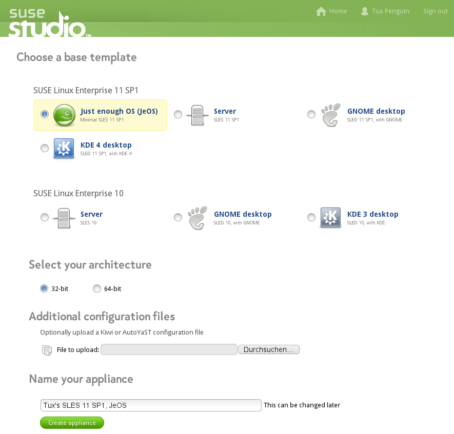
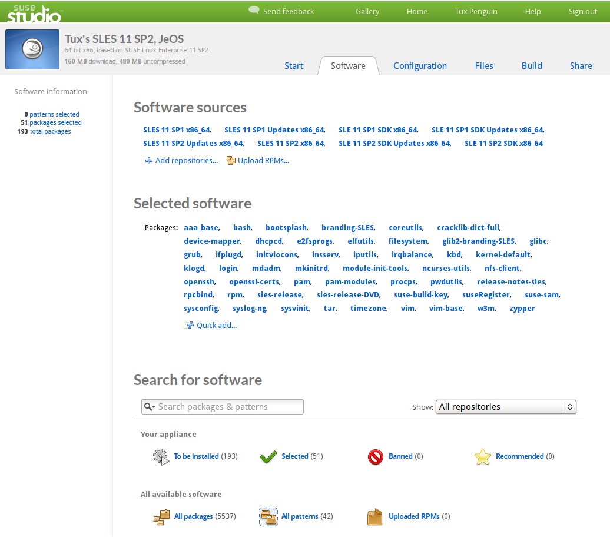
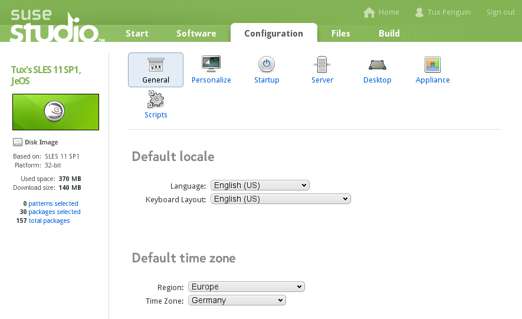
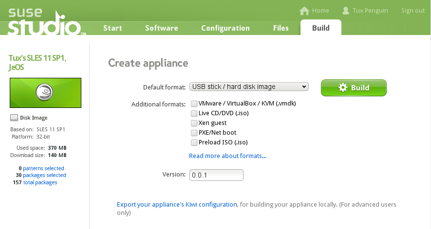

# Getting Started

To build software appliances, follow these steps:

## 1. Log In

Log in to SUSE Studio with an account of your choice.

## 2. Choosing a Base Template.

The base template determines the operating system your appliance is
based upon. This can be any of the openSUSE, SUSE Linux Enterprise
Desktop, or SUSE Linux Enterprise Server flavors, for either 32-bit or
64-bit x86 architectures.

## 3. Adding Software

Optionally extend the chosen base template with additional software from
the standard sources, from an external repository, or by uploading an
RPM. For more explanations, see Section 2, "Adding Software".

## 4. Configuring Your Appliance

Personalize the appearance, locale, network, and other settings of your
appliance. For advanced configurations, edit the build and boot scripts.

## 5. Creating Your Appliance

Build the appliance in different downloadable formats like ISO, USB
stick, hard disk image, VMware/VirtualBox image and Xen guests, or
target the cloud with EC2 and Azure formats.

## 6. Testing Your Appliance

With the "testdrive" of SUSE Studio start a test session in your browser
and log in with SSH or VNC. The "Modified Files" feature allows you
track and import changes to the file system made during a testdrive.

## 7. Downloading Your Appliance

After a successful build, download the appliance and deploy it on your
hardware, virtual machine host, or preferred cloud provider.
