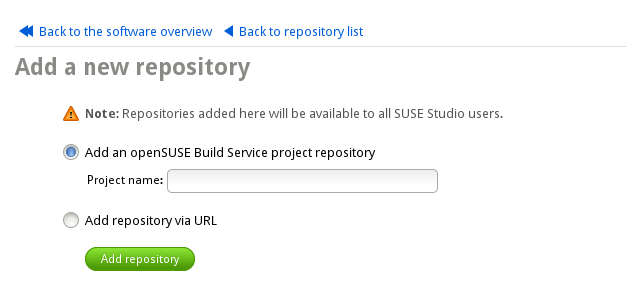

# Adding Software

Once you've created your appliance from a base template, you have a few
different options for adding software:

1. **Base template sources.**  Every base template is pre-subscribed to
   repositories that supply the software for the template. Every package
   included in the OS is available through these repositories; the base
   templates simply use a different subset of the software to provide a
   tailored foundation for your appliance.

2. **External sources.**  Add additional repositories from the
   [openSUSE Build Service](http://build.opensuse.org) or any other
   compatible software collection on the web. *Be sure to use sources
   which are compatible with the base template you selected.*
   Popular third-pary sources include [Packman](http://packman.links2linux.org/),
   [VideoLan](http://www.videolan.org/vlc/download-suse.html), and
   hardware vendors. [The openSUSE wiki](http://en.opensuse.org/Additional_package_repositories)
   has a more definitive list.

3. **Any Compatible RPM.**  Upload any compatible RPM package from your
   hard disk or from the web to SUSE Studio. Make sure it's built for an
   OS version & architecture compatible with your appliance.

*You will be notified if any dependencies cannot be fully resolved.*

## 1. Adding External Repositories

To add an external repository from [OBS](http://build.opensuse.org) to
SUSE Studio:

1. Click "Add Repositories..." on the Software tab. You'll see
   a selection of available repositories, submitted by users:

   

2. Enter a search term to reduce the list of shown repositories.
   When you find the repository you're looking for, click the "add" to
   include it in your appliance.

3. If your can't find what you're looking for, click "Import New
   Repository..." and enter either the name of an
   [OBS](http://build.opensuse.org) project, or the URL of a collection
   on the web:

   

## 2.2. Uploading RPMs

SUSE Studio allows you to upload software packaged in the RPM format. If
you have a few RPMs you need to upload, you may find it easier to create
an archive (.tar, .tar.gz, .tgz, .tar.bz2, .tbz, or .zip) and upload
that to SUSE Studio instead of uploading each individual package. SUSE
Studio can extract this archive and add the individual RPM packages to
your software collection.

Click "Upload and manage RPMs..." and you'll see a list of packages you
have uploaded into your appliance. To upload a package on your local
machine, click the "Upload RPM..." button, or click "Add from the Web
(URL)..." and enter an address for SUSE Studio to fetch the package
directly.

Regardless of the method, SUSE Studio adds the RPM(s) to your software
selections and tries to resolve any dependencies. In case of an error,
SUSE Studio will notify you. Resolve the errors by adding additional
external repositories, importing other RPMs, or removing any problematic
RPMs.
