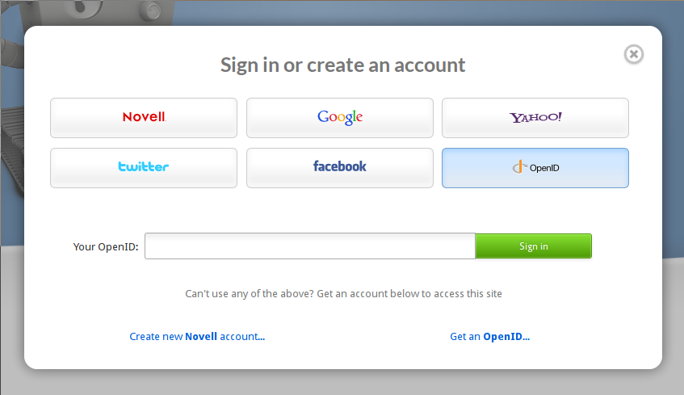
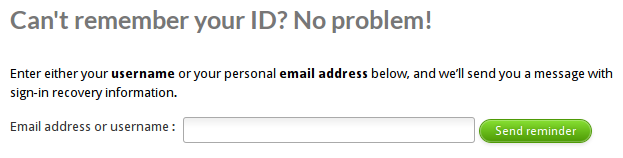

# Logging In

Before you can use SUSE Studio, you need to log in.

SUSE Studio allows you to use your login credentials from [Novell],
[Google], [Yahoo], [Twitter], [Facebook], or an any [OpenID] provider.

[Novell]:   https://secure-www.novell.com/selfreg/jsp/createAccount.jsp
[Google]:   https://accounts.google.com/NewAccount
[Yahoo]:    https://edit.yahoo.com/registration
[Twitter]:  https://twitter.com/
[Facebook]: https://www.facebook.com/
[OpenID]:   http://openid.net)

The first time you log in, we'll create an account for you, linked to
your preferred login provider. You're welcome to link other accounts to
your Studio account:

1. Click on "Edit account"
2. On your account page, switch to the "Linked accounts" tab.
3. Click "Add another account..."

You'll be prompted to login again, but this time we'll link your
accounts instead of creating a new one.

If you forget your credentials, the [account help form] will help you
out by letting you search by username or email, and sending you a hint
about your login.

[account help form]: http://susestudio.com/account/help

