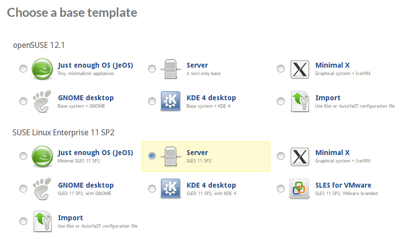

# Selecting a Base Template

After you log in to SUSE Studio for the first time, you need to select
one of the available base templates on which to build your first
appliance. A base template determines the operating system your
appliance is based on, which packages will be initially selected, and
the processor architecture.

Each operating system offers different choices of base templates:

**openSUSE 12.1**
The current release of openSUSE. Choose from:
* **Just enough OS (JeOS)**, a minimalistic template.
* **Server**, a text-only system suited for servers, but with a larger
  imprint than JeOS.
* **Minimal X**, adding an X server, and preconfigured with IceWM and
  XDM. This is an ideal template for building on an alternative DM/WM
  such as LXDE or XFCE.
* **GNOME desktop**, preconfigured with a minimal GNOME 3.2 desktop and
  GDM.
* **KDE 4 desktop**, preconfigured with a minimal KDE 4.7 desktop and KDM.

**SUSE Linux Enterprise 11 SP2**
Contains version 11 with service pack 2 of SUSE Linux Enterprise Server
and Desktop. Base templates include:
* **JeOS**,
* **Server**,
* **Minimal X**,
* **GNOME desktop**, with GNOME 2.28,
* **KDE 4 desktop**, with KDE 4.3,
* **SLES for VMware**, branded for use with VMware servers.

**SUSE Linux Enterprise 10 SP4**
Contains version 10 with service pack 4 of SUSE Linux Enterprise Server
and Desktop. SLE10 has a more limited set of base templates:
* **Server**,
* **GNOME desktop**, with GNOME 2.12,
* **KDE 3 desktop**, with KDE 3.5.
