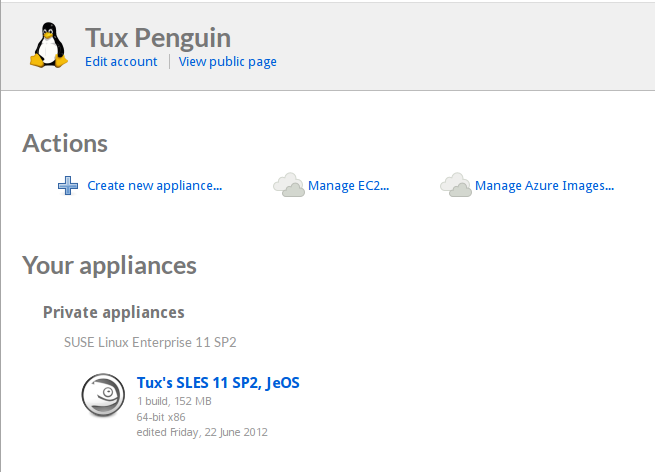

# Viewing Your Home Page

If you have already created an appliance, SUSE Studio lists your
appliances, grouped by access rights (your private appliances, your
gallery appliances, and appliances other users have shared with you.)

From here, you can:

* **Create a New Appliance.** Click "Create new appliance..." and choose
  a base template, like you did for you first appliance.
* **Manage Your Cloud Deployments** Upload your EC2- or Azure-formatted
  images, and manage your uploaded images.  See [Use > Amazon Ec2] and
  [Use > Windows Azure] for details.
* **Work on Existing Appliances.** Click an entry on the appliances
  lists to work with a saved appliance. To use a previously saved
  appliance as a base template, mouse over it and click "Clone" to
  create a new appliance based on the currently selected one. Cloning
  an appliance from the home page will copy the latest configuration of
  the appliance. If you want to clone the configuration of a specific
  version of the appliance, you can clone from the build tab when
  editing this appliance.
* **Clone Shared Appliances.** If another user has shared an appliance
  with you, you may clone it, starting a new appliance based on it. You
  cannot modify an appliance that is shared with you.

[Use > Amazon Ec2]:    ../use/amazon-ec2.html
[Use > Windows Azure]: ../use/windows-azure.html
