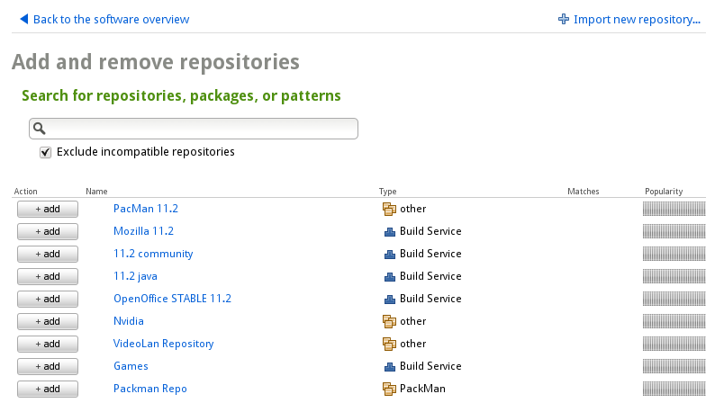

# Selecting Software

[OBS]:               http://build.opensuse.org
[Packman]:           http://packman.links2linux.org/
[VideoLan]:          http://www.videolan.org/vlc/download-suse.html
[openSUSE wiki]: http://en.opensuse.org/Additional_package_repositories
[openSUSE software search]: http://software.opensuse.org/search

SUSE Studio provides comprehensive tools for modifying your appliance's
software selection to suit your needs. You can add missing software or
remove existing software from your base template.  You can use the
current version, which can be updated automatically, or lock onto a
specific version. Choose your software from three sources:

1. **Base template sources.**  Every base template is pre-subscribed to
   repositories that supply the software for the template. Every package
   included in the OS is available from these repositories; the base
   templates simply use a different subset of the software to provide a
   tailored foundation for your appliance.

2. **External sources.**  Add additional repositories from the [openSUSE
   Build Service][OBS] or any other compatible software collection on
   the web. *Be sure to use sources which are compatible with the base
   template you selected.*
   Popular third-party sources include [Packman], [VideoLan], and
   hardware vendors. The [openSUSE wiki] has a more definitive list.

3. **Any Compatible RPM.**  Upload any compatible RPM package from your
   hard disk or from the web to SUSE Studio. Make sure it's built for an
   OS version & architecture compatible with your appliance.

## Base template sources

The OS base templates provide a substantial library of software that is
easily included via the *Software* tab:

2. If you already know the name of your package, click "Quick add..."
   and enter the name. If a package by that name exists, it will be
   automatically added to your appliance.

3. If you do not know the exact name, enter a term into the search box
   in the *Search for software* section. SUSE Studio displays a list of
   packages and patters with their names, version, size, repository, and
   popularity.

4. Click the "add" button to include the current version in your
   appliance. If multiple versions are available, click the icon next to
   the package's version number and select the desired version from the
   list. *Adding a version older than the "most recent" will prevent
   updates from being automatically applied to that package.*

Any dependencies will be automatically resolved and you will be notified
of the total number of packages and installed size increase to your
appliance. If your package selection creates a conflict, you will be
prompted with options to resolve the conflict.

## Adding external software sources

In addition to the software available in the base repositories, an
ever-growing library of software is available via the openSUSE Build
Service and other external software repositories. SUSE Studio provides
the same benefits to software added via external repositories as it does
for base repositories: you will still automatically recieve available
updates, and dependency resolution will work across all the repositories
included in your appliance.

1. Click "Add repositories..." to switch to the repositories list.

2. Here, you can search for a repository by name or by software
   packages included in the repository. When you find the repository you
   were looking for, click the "add" button to include it in your
   appliance.

3. If your can't find what you're looking for, click "Import New
   Repository..." and enter either the name of an
   [OBS] project or the URL of a collection on the web:

* **OBS Projects.**  Select "Add an openSUSE Build Service project
  repository" and enter the project name. Project names and their
  contents can be found either by searching in [OBS] directly or via
  [openSUSE software search].
* **Other online repositories.** Select "Add a repository via URL",
  chose an appropriate name for the repository, and enter the URL of
  the external repository.

*Whenever a user adds a repository, the repository will be available for
all users.*

All packages in the newly added repository are now available to your
appliance and may be added via the methods described above for base
template sources.

## Adding compatible RPM packages

If you have downloaded or built an RPM package yourself, you can upload
it to SUSE Studio for use in your appliances. Packages you upload are
stored in a special, personal repository that is available to all
your appliances.

> **Use Only Compatible RPM Packages.** Although SUSE Studio verifies
> your RPM packages after the upload, we recommend checking your RPM
> packages in advance. Checking for matching CPU architecture and
> distribution will save bandwidth and time:
>
> * Same Architecture: you cannot install a 64-bit RPM package on
>   a 32-bit appliance. The architecture is part of the RPM filename
>   (watch for i586 or x86_64). *You can install 32-bit packages on
>   a 64-bit appliance, but these packages usually have '32-bit' in
>   the name, but still have a* x86_64 *arch.*
> * Same Distribution: it is not recommended to install an openSUSE
>   package on a SUSE Linux Enterprise product, or vice versa, or
>   to use an RPM packaged for another distribution.
>
> You can use the *rpm* command line to find information about your
> package by executing the following command:
>
> `rpm -qp --queryformat "%{NAME}: %{DISTRIBUTION} %{ARCH}\n" RPMFILES`

### Uploading a single RPM package

1. Click "Upload RPMs..." to see a list of all
   packages already included in your personal repository.

2. Select your RPM either from your file systems with "Upload RPM..." or
   from a public source with "Add from the Web (URL)...".

3. Add as many RPM packages as you want. You can also remove existing
   packages from your personal repository.

4. Click "Back to the software overview".

If you need to add more RPM packages, the previous procedure can be
cumbersome. In this case, create an archive first, then upload the
archive to SUSE Studio. This archive file should contain all the RPM
packages you want to add and can be in *.tar*, *.tar.gz*, *.tar.bz2*, or
*.zip* format.

### Uploading a ZIP archive containing multiple RPM packages

1. Create a directory `/tmp/RPMs`.
2. Copy all your RPM packages to `/tmp/RPMs`.
3. Open a shell, for example press *Alt+F2* and enter `xterm`.
4. Execute the following commands:

       cd /tmp/RPMs
       zip myrpms.zip *.rpm

5. Upload the archive as described above, "Uploading a single RPM
   Package". After a successful upload, the archive name is shown
   in the list.
