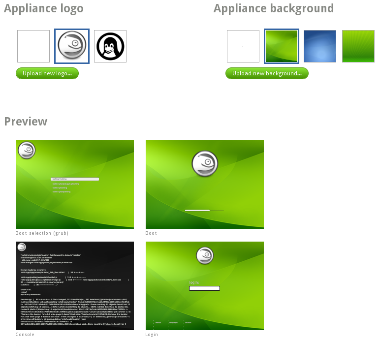

# Configuration

The *Configuration* tab and its subsections provide a simplified
interface for customizing common configuration options.

**General**
Change your default locale and timezone, configure your network, enable
your firewall, and manage users and groups.

**Personalize**
Add a new logo and background for your appliance or pick from the default
options and see an overview of how your appliance will look like during
boot and login in the Preview section.

**Startup**
Define your default runlevel and any end user licence agreements.
Usually this is empty, but if you add any EULAs, the user has to agree to
your licences during the first boot of your appliance.

**Server**
Set up a PostgreSQL or MySQL database server, including upload of an
existing data set and creation of database users.

**Desktop**
Configure automatic login for users and programs which are automatically
started after login.

**Appliance**
Set up advanced configuration for your appliance, like disk, memory, and
logical volume manager. Many of these settings depend on the environment
your appliance will run in.

**Scripts**
Run custom scripts at the end of your build, on first boot, or every
boot. *Usually for experts only.*

In the following sections we describe some common scenarios:

## Defining the default locale

Locale defines the initial language and keyboard layout your users will
use. Depending on your appliance's base template, the default locale
may be "English (US)" or "POSIX", with an "English (US)" keyboard
layout.

On the *Configuration+General* tab, you can select from a comprehensive
list of supported languages and keyboard layouts. *You may be prompted
to add locale-specific packages.*

If you are uncertain of the locale your appliance will be used in or
would like to provide your appliance's users the widest choice, you may
select "Ask on first boot". *YaST* will then prompt your users during first boot to select the locale.

**YaST** *is also used to accomodate the* "Ask on first boot" *option
for time zones.*

# Customizing network settings

SUSE Studio allows one-click customization for four common networking
scenarios as well as the option to manually configure network settings.
Choose from:

* **Do not configure network.** Disable the network altogether.

* **Configure network during first boot.** Use *YaST* to let your users
  configure the network during the appliance's first boot.

  __Note for s390 users__: the appliance tries to activate DASD 191 and search
  for the parm file named "<USER_ID>.PARM-S11". Replace <USER_ID> with the name 
  of the guest, for example, LINUX035.
  If the file is found, the parameters are used to set up the network.
  The parm file should be parseable by Bash:

      hostname=s390guest03.domain.net hostip=192.168.1.5 gateway=192.168.1.254
      nameserver=192.168.1.254 netmask=255.255.255.0 domain=domain.net
      broadcast=192.168.1.255 instnetdev=osa readchannel=0.0.070a
      writechannel=0.0.070b datachannel=0.0.070c layer2=0
      osainterface=qdio osamedium=eth portno=0 portname=vswn1
  
  If the parm file is correct the network should be set up without any
  user interaction but manually accepting the EULA is still required.

  If no parm file is found the system boots normally but there won't be any network.
  If the file is found but some important parameters are missing the
  appliance might throw a reboot error.

* **Use NetworkManager to configure the network at run-time.** Enable
  the network through NetworkManager.
  See the [SLES Administration Guide][nm-sles] or the
  [openSUSE documentation][nm-open] for more information on
  NetworkManager in SUSE Linux.

[nm-sles]: http://www.suse.com/documentation/sles11/book_sle_admin/?page=/documentation/sles11/book_sle_admin/data/sec_basicnet_nm.html
[nm-open]: http://doc.opensuse.org/documentation/html/openSUSE/opensuse-reference/cha.nm.html

* **Discover network settings automatically (DHCP).** Use a DHCP server
  to get the IP address.

* **Manually configure network.** Enter the hostname, IP address,
  netmask, route, and name servers manually.

*For more advanced configurations, such as multiple IPs or routes, you
must either configure via scripting, uploaded files, or with* **YaST**
*while Testdriving your appliance.*

## Adding Users and Groups

At the bottom of the *Configuration+General* tab, set your inital *root*
password and create as many additional user accounts for your appliance
as you need. Desktop appliances include a 'tux' user for your
convenience, but feel free to change or delete it. You can set group
memberships, optionally define UIDs and specify home directory paths and
user shell.

## Custom Theming

SUSE Studio makes it easy to customize the backgrounds in your
appliance and apply a custom logo, from bootstrapping to the desktop,
via the *Configure+Personalize* tab:

1. Select from predefined logos, no logo, or upload your own.

2. Do the same for the background.

The *Preview* section shows an overview of how your appliance will look
during the various phases of the boot process and the interface your
users will be presented with.

## Adding an End User Licence Agreement (EULA)

Depending on the software you add to your appliance or its intended end
use, it may be necessary that the user agrees to a license, or multiple
licenses, during boot time.

If you want to add a license (EULA) to your appliance, go to
*Configuration+Startup* and click "Add a new EULA". Insert your license
in the text field. It is possible to enter more licenses, if necessary.

*In most cases, end users of SLE appliances will be presented with the
SLE license as well.*

## Customizing for virtual environments

The *Configure+Appliance* tab presents a number of options for
configuring your appliance that only apply to certain formats, such as:

* Configure the disk size and system memory for OVF, VMware, and Xen
  virtual machines.
* Configure the disk size for EC2 & Azure images.

Enter values for the memory to be allocated to a VM in MB, as well as
the disk size in GB. *Memory must be a multiple of 4MB*.

If your appliance is intended to be a Xen host (or Xen hypervisor),
check "Enable Xen host mode" and SUSE Studio will install the packages
`xen-kernel`, `xen-tools`, and related packages to the Xen hypervisor.

The checkbox "Enable VMware CD-ROM support" is a workaround for a bug in
VMware Workstation. This bug causes the host Windows 2003 Server to
crash if CD-ROM support is enabled. Use this option to enable CD-ROM
support in the VMware virtual machine.

## Using LVM

The Logical Volume Manager (LVM) is an abstract layer between hard
disks, partitions, and file systems. LVM gives the system administrator
more flexibility in designing system storage. The following diagam
compares physical partitioning (left) with LVM segmentation (right).

On the left, one single disk has been divided into three physical
partitions (PART), each with an assigned mount point (MP) so that the
operating system can access them. On the right, two disks have been
divided into two and three physical partitions. Two LVM volume groups
(VG 1 and VG 2) have been defined. VG 1 contains two partitions from
DISK 1 and one from DISK 2. VG 2 contains the remaining two partitions
from DISK 2. In LVM, the physical disk partitions that are incorporated
in a volume group are called physical volumes (PVs). Within the volume
groups, four logical volumes (LV 1 to LV 4) have been defined,
which can be used by the operating system via the associated mount
points. The border between different logical volumes do not have to be
aligned with any partition border. See the border between LV 1 and LV 2
in this example.

See the [SLES Administration Guide][lvm-sles]
or the [openSUSE documentation][lvm-open]
for more information on LVM in SUSE Linux.

[lvm-sles]: http://www.suse.com/documentation/sles11/stor_admin/?page=/documentation/sles11/stor_admin/data/lvm.html
[lvm-open]: http://doc.opensuse.org/documentation/html/openSUSE/opensuse-reference/cha.advdisk.html#sec.yast2.system.lvm

SUSE Studio supports LVM with *one volume group*. To create your
individual logical volumes, switch to the *Configure+Appliance* tab and:

1. Enable the *Configure LVM* checkbox.
2. Enter the volume group name. The default is `systemVG`.
3. Click "Add new LVM volume...".
4. Enter the volume mount path and its size. *You need at least one
   volume entry.*
5. More can be added by clicking "Add new LVM volume..." again.
