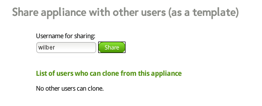

# Sharing Appliances with Other Users

To share an appliance, select your appliance from the home site and go to the
*Share* tab, see Figure 2.5, "Appliance Summary for Sharing".

*Figure 2.5. Appliance Summary for Sharing*

If you want to share your appliance with other users, enter the user name to
allow cloning of your appliance. Finish by clicking the Share button. The
permitted user sees your appliance on his home site.
