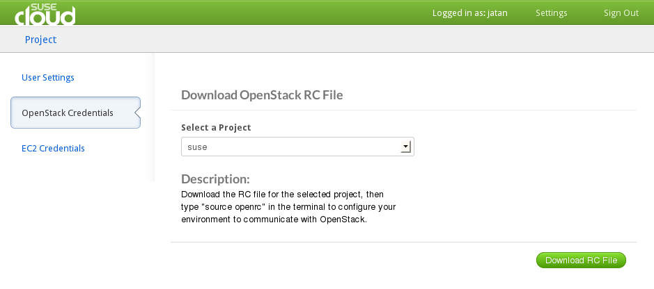
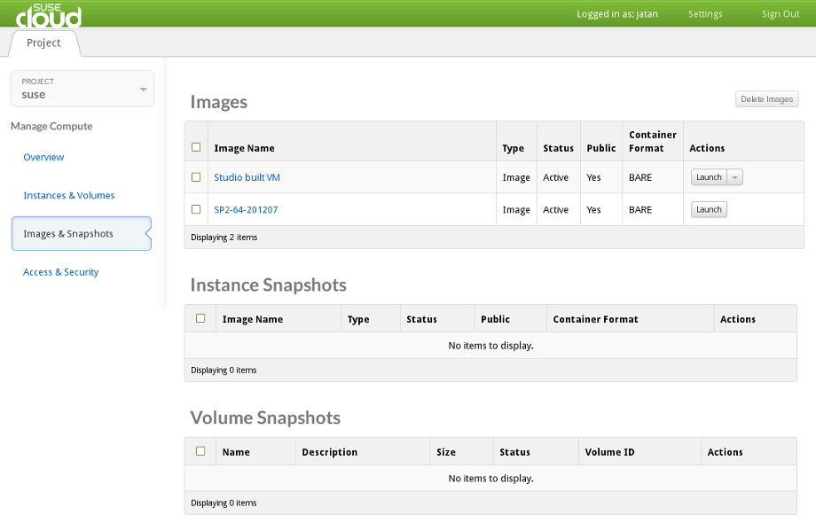

# SUSE Cloud

[SUSE Cloud][suse_cloud] is a pre-packaged and supported version of OpenStack that has
been tested to work with the SUSE family of products. It is designed for
organizations to setup and manage their own private clouds. It is much
easier to install and setup than the vanilla OpenStack.

SUSE Studio allows for seamless integration with SUSE Cloud. You can build
images ready to be used in SUSE Cloud for manual import.

Before you can upload an image you have to build it. Switch to the
Configuration > Appliance tab. Enable the *Integrate with SUSE Cloud / OpenStack*
checkbox and build an *SUSE Cloud / OpenStack / KVM* image.

While the image builds you can prepare for the uploade:

* Download the openrc.sh from SUSE Cloud:
  Go to Settings > OpenStack Credentials and click on *Download RC File*.

* Source the openrc.sh script:
  <pre>. openrc.sh</pre>

* Install python-glanceclient from [Cloud:OpenStack:Grizzly][cloud_project] repository on your system:
  <pre>zypper addrepo \
    http://download.opensuse.org/repositories/Cloud:/OpenStack:/Grizzly/SLE_11_SP2/ \
    Cloud:OpenStack:Grizzly
  zypper refresh Cloud:OpenStack:Grizzly
  zypper install python-glanceclient</pre>

Once the build finished you can copy the url from the download link and enter
following command on the commandline:
  <pre>glance image-create --name="Studio built VM" --is-public=True \
    --disk-format=qcow2 --container-format=bare \
    --copy-from $download_url</pre>

This will upload the image to SUSE Cloud. Note that you need a signed SSL certificate to upload the image.

The uploaded image should now be listed under *Images & Snapshots*.

Launch the image, then use your keyfile to ssh into it:
  <pre>ssh -i my_keypair.pem root@10.122.160.81</pre>

Enter `chmod 600 my_keypair.pem` to set correct permissions for the keyfile.

[suse_cloud]: https://www.suse.com/de-de/products/suse-cloud/
[cloud_project]: http://download.opensuse.org/repositories/Cloud:/OpenStack:/Grizzly/

