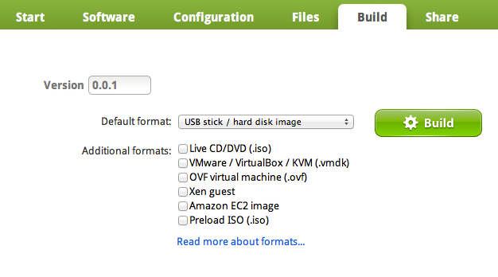

# WebHooks

A [WebHook][webhooks] is a simple event notification/callback mechanism via HTTP
POST.

## Setting up WebHooks

SUSE Studio provides [WebHooks][webhooks] feature, which you may utilize, by
adding a URL that will receive POST requests upon complete build. The JSON sent
will contain information about the build and a public download URL for you to
download the image directly.

The following Ruby template is used to generate JSON:

    {
      :event => 'build_finished',
      :id    => image.appliance_id,
      :name  => image.name,
      :build => {
        :id         => build.id,
        :version    => image.version,
        :image_type => image.image_type,
        # Units of image_size and compressed_image_size are in MB.
        :image_size => build.image_size,
        :compressed_image_size => build.compressed_image_size,
        :download_url => download_url,
        :md5          => build.md5sum
      }
    }

Example of the generated JSON:

    {
      "event": "build_finished",
      "id": 24,
      "name": "My appliance",
      "build": {
        "id": 11,
        "version" : "0.0.1",
        "image_type": "oem",
        "image_size": 645,
        "compressed_image_size": 140,
        "download_url": "http://susestudio.com/download/f79d576ed150a0b877462fc0b3dcb92f/My_appliance.x86_64-0.0.1.oem.tar.gz",
        "md5": "f79d576ed150a0b877462fc0b3dcb92f"
      }
    }

With the JSON data, you may wish to use the following examples, to process the
received POST requests.

Example in Ruby (using SinatraRB):

    #!/usr/bin/ruby
    #
    # Make sure to run the following command, to install the required gems:
    #   sudo gem install sinatra json
    #

    require 'rubygems'
    require 'sinatra'
    require 'json'

    post '/' do
      data = JSON.parse(params[:payload])

      puts data.inspect

      # check if event is build_finished and image_type is xen
      if data[:event].eql?('build_finished') && data[:build][:image_type].eql?('xen')
        # create new thread to process image
        task = Thread.new do
          # pass the download url to your-shellscript.sh to process the image
          system "./your-shellscript.sh #{data[:build][:download_url]}"
        end
      end
    end

Example written in Perl for use as a CGI script:

    #!/usr/bin/perl -w
    use strict;
    use CGI ":standard";
    use JSON::XS;

    print header(),"OK";
    my $json=param("payload");
    my $data=decode_json($json);
    open(LOG, ">", "/tmp/json.log") or die $!;

    chdir "/tmp";

    my $pid = fork(); # run in background to not block caller
    if($pid) {print "forked pid $pid"; exit 0;}
    close STDOUT;
    close STDERR;
    close STDIN;
    open STDOUT, ">&LOG";
    open STDERR, ">&LOG";

    my $url=$data->{build}->{download_url};
    my $filename=$url; $filename=~s{.*/}{};
    my $rawname=$filename; $rawname=~s/\.oem\.tar\.gz/.raw/;
    system("wget -q -O- $url | tar xzO $rawname | cp --sparse=always /dev/stdin $rawname");
    system("glance-upload", $rawname, $rawname);
    print LOG ("glance-upload $filename $filename");
    close LOG;

## Testing WebHooks

WebHooks are triggered whenever a build completes successfully. In this example,
we build an appliance and use <http://www.postbin.org> to demostrate how you
could test WebHooks and look at the actual data being sent.

### Setting up

Visit PostBin and click “Make a PostBin”. You will be directed to a page with a
URL like the following:

Copy the URL and paste it into your SUSE Studio account's page and save:

### Trigger WebHooks

To test that the hook fires you will need to build an appliance. In this example
we build an existing appliance.

When the build completes, a call will be made to the URL stored in your account
settings.

Finally, check the exact data sent by reloading the PostBin page.

[webhooks]: http://wiki.webhooks.org
