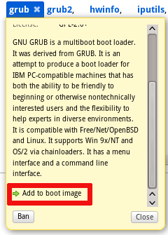

# Appliances

* This will become a table of contents (this text will be scraped).
{:toc}

## Isn't it difficult to create appliances?

No, it's quite simple! The SUSE Studio team designs and implements the
entire site with the goal of making it easy.

After your first sign in you will not have an appliance. From your home
page, you can create a new appliance and select a template to create
your own custom appliance.

**Software:** Add/Remove packages and repositories (you will have access
to the openSUSE build service) or upload your own rpms.

**Configure:** Configure locale settings, startup options, database use,
storage management and other things like the look and feel via logos and
wallpaper

**Overlay files:** Add "overlay files" to fine tune the application and
system configuration

**Build:** Start the build run to create
+ a Disk Image,
+ a LiveCD/DVD,
+ a VMware Image,
+ or a Xen Image. 

**Testdrive:** Whwn the build is finished, launch and interact with your
creation in a virtual machine in your browser window, make changes, and
commit those changes to the appliance. To do this, use the Modified
files tab in Testdrive.
Then implement your changes via a new build run and download the
resulting image via the Build tab.

## How can I upload custom RPMs?

Under the tab "Software" &rarr; "Upload RPMs" you can upload locally saved
RPMs or packages from the web. They must be in the format .rpm or
archives of RPMs in .tar, .tar.gz, .tgz, .tar.bz2, .tbz or .zip format.

## How can I add packages to the boot image (initrd)?

Under the "Software" tab there is a list of your selected packages. 
Click the package link and it will show a description of the package.
Scroll down a bit and click the 'Add to boot image' link:
   

## What appliance formats are available?

Currently you can create images for USB stick / hard disk, Live
CD/DVD, VMWare / Virtual Box / KVM, OVF virtual machine, XEN guest, Hyper-V and
Preload ISO, or target public clouds, including Amazon EC2 and Microsoft Azure.

## How can I publish an appliance?

After creating a working appliance, go to the "Share" tab, add a
description of what your appliance does and tags for easier finding. Save
your changes, select the version you want to publish, and press
"Add". Now everybody can find your appliance on SUSE Gallery.

## How can I unpublish an appliance?

Go to your [SUSE Studio home page](http://susestudio.com/home). Select your appliance
and click on the "Share" tab. In the "Share with everyone" section,
select the version you want to unpublish and click the "Unpublish"
button.

## How can I build a standard image (like JeOS or Server)?

When creating a new appliance, you will start with a predefined template, 
based on openSUSE 12.2, SLE11 SP2 or SLE10 SP4 for 32 and 64-bit x86 systems.
These work out of the box without any changes. Alternatively, download images
from other users in Gallery.

## What is a "Overlay File"?

It's a file that will overwrite existing files. In Studio it is under
"Files".

## Which are the default permissions for users in postgresql?

If you add users to the postgresql and specify the databases they have access to it, studio will grant all privileges on that databases to those users.

You may not want to do that for security implications. If that is the case, we advice you to set up the users and grant them privileges as sql calls in the postgresql dump.

If you have uploaded a postgresql dump that creates a database, you need to run the grant commands in the dump as well.

For more information on how to create users and grant them privileges, see:

http://www.postgresql.org/docs/9.4/static/sql-grant.html

## Do SLES images exported to EC2 fall under the terms and conditions of http://aws.amazon.com/suse/  or under the Linux/Unix usage at http://aws.amazon.com/ec2/ ?

Under the former
([http://aws.amazon.com/suse/](http://aws.amazon.com/suse/)), hence you
get full access to updates, albeit with a slight price premium.

## I want to export my openSUSE-based appliance to EC2 as a micro instance, but the deployer disallows it. How can I get it working?

Amazon provides the micro instance type for EBS-backed AMIs only.

The create_ami.sh script included in Studio-built openSUSE images
currently creates only S3-backed AMIs.

Meanwhile, you can try tweaking the create_ebs_ami.sh script for SLES-based EC2 images to work with your openSUSE-based image.

## Can I link to my appliance from other websites?

Sure, we really appreciate and recommend that. The link to the public
appliance page is permanent and can safely be used for linking.

## How can I get my appliance to become an official openSUSE product like openSUSE Medical?

[openSUSE Medical](http://en.opensuse.org/Portal:Medical)

-> to be added!
